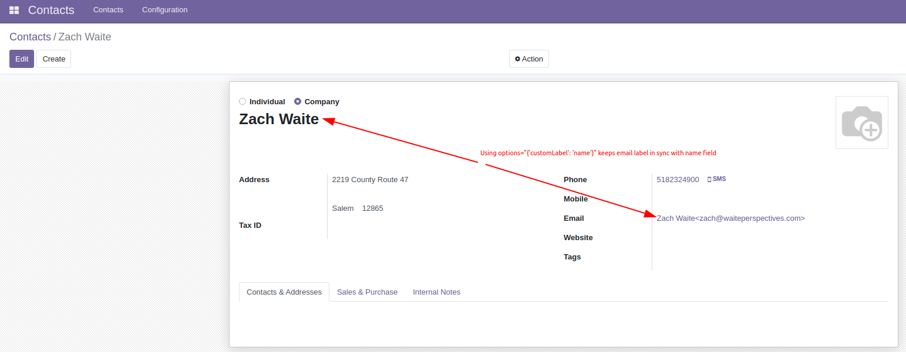

# Custom Odoo Field Widget Example

This is a minimal example of a custom field widget.

It simply extends the base email field to display a formatted version of the
email with a custom label that is derived from some other field in the form view
when in read mode. In the example below, the name field is used as the custom
label.

